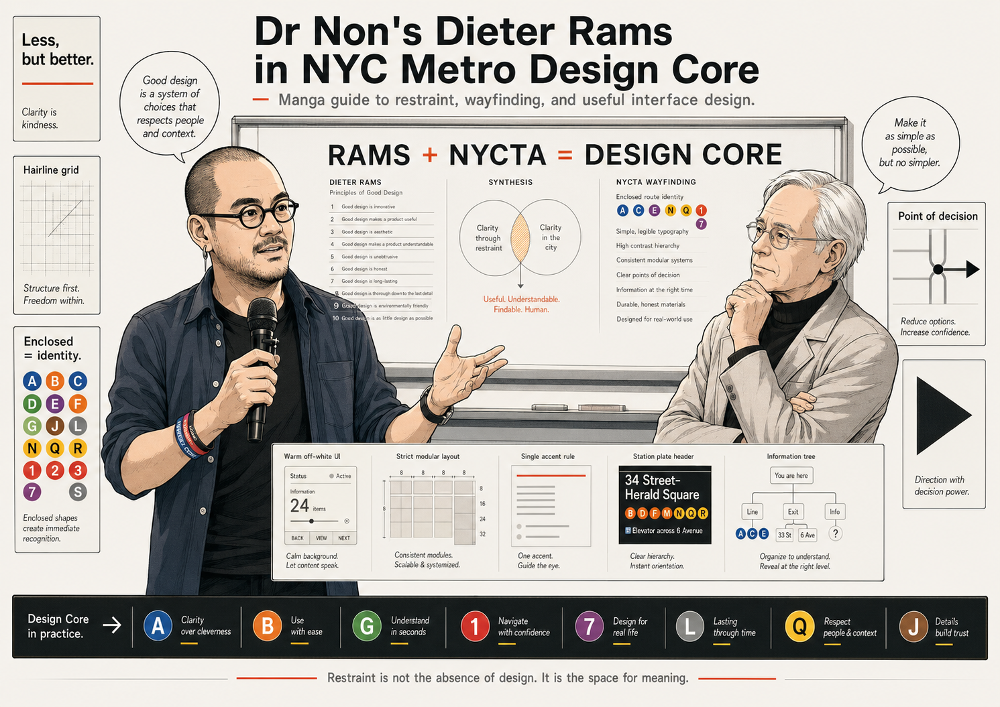
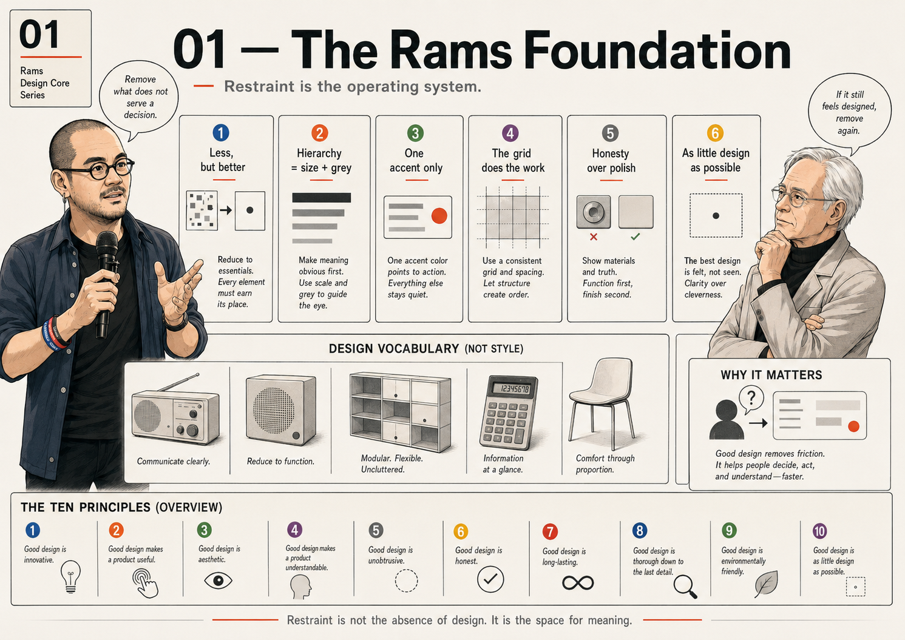
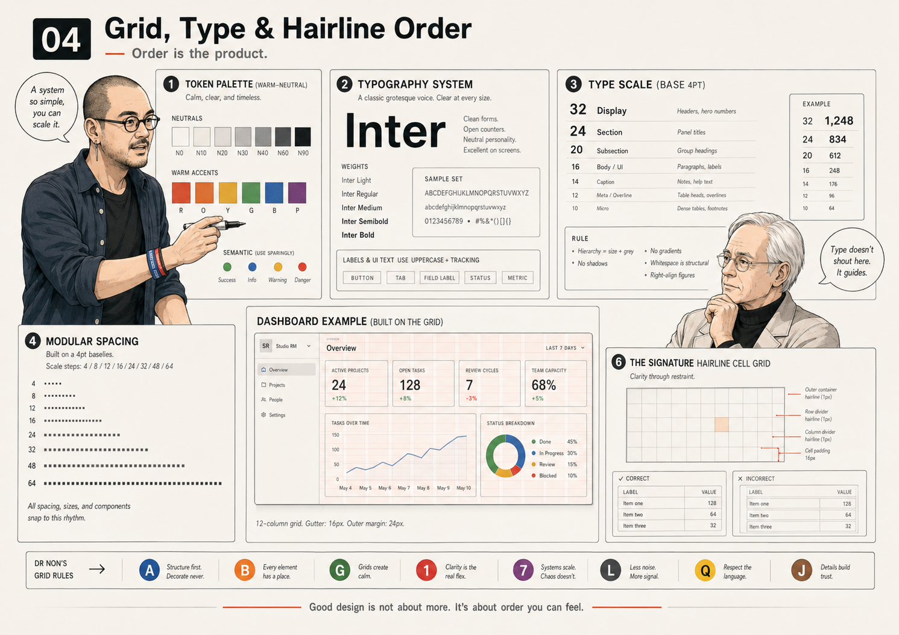
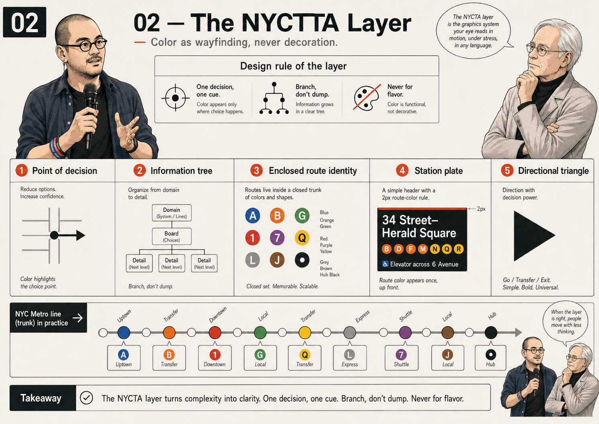
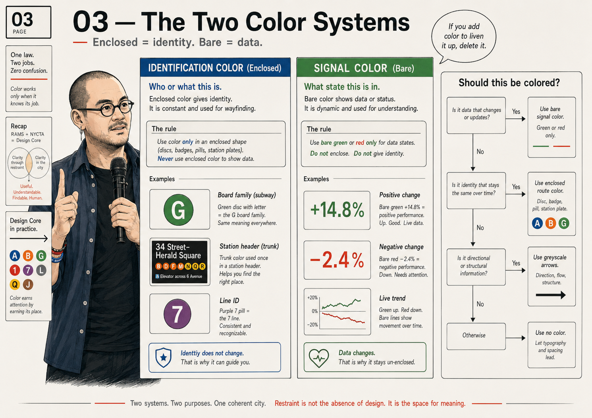
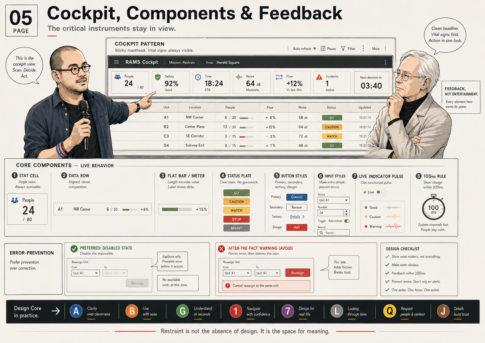
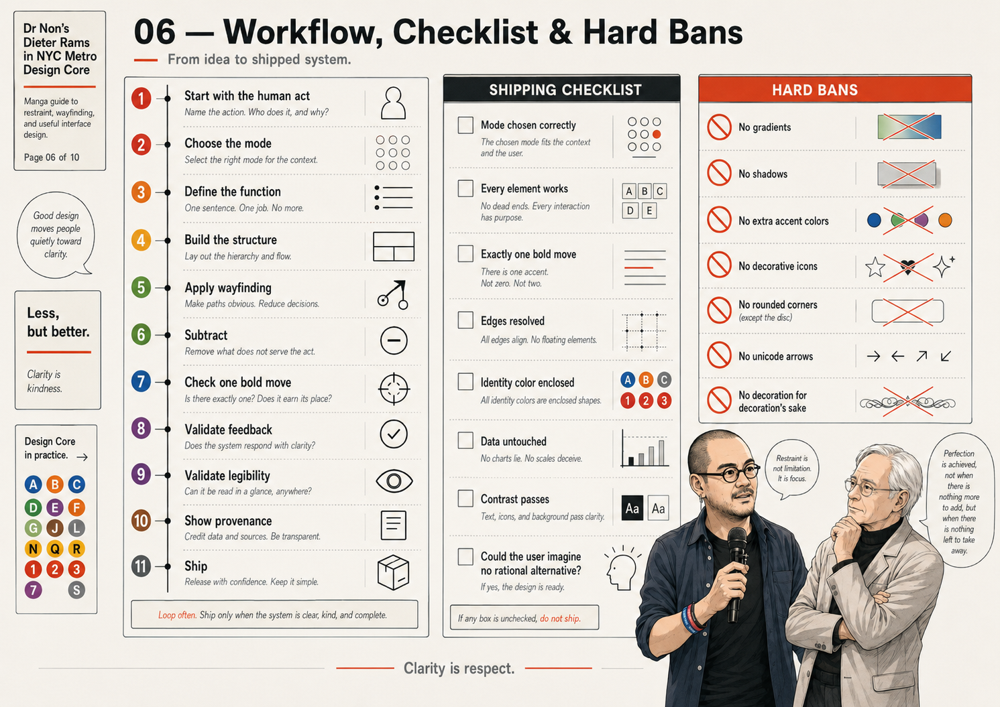

# Dr Non's Rams × NYCTA Design Core

> Less, but better.  
> Information at the point of decision. Never before. Never after.  
> When the color system makes itself invisible as "design" — it is finished.

**By:** Non Arkaraprasertkul — architect, anthropologist, decision-systems builder  
**Lineage:** Dieter Rams (Braun, 1950–1995) × Bob Noorda & Massimo Vignelli / Unimark International (NYCTA, 1970)  
**What this is:** A reproduction-grade interface standard — exact values, not vibes — extended with the philosophical substrate that drives why these systems matter.



---

## The Thesis

Two masters. One law.

**Dieter Rams** gave us silence — a warm-grey, near-monochrome field where data leads and the tool disappears. Every element justified by function. Everything else removed. The mark of a resolved design: the user cannot imagine a rational alternative.

**Bob Noorda & Massimo Vignelli** gave us, within that silence, a voice for orientation — a small, closed, rigorously coded set of colors that tell you exactly where you are and where to go, and say nothing else. Enclosed color for identity. Bare color for signal. The two never blur.

Neither contradicts the other because both are governed by the same law: **nothing appears that does not serve a decision.** Rams removes the decorative. Unimark codifies the necessary. Color, here, is never indulgence. It is the smallest possible amount of signage required to navigate a complex system safely.

Both aim at the same feeling: **inevitability.** A correct route system feels like it could not be otherwise — orange is macro, the disc is the address, the arrow is forward — so that, at a glance, the user knows exactly where they are and how to move. When design makes itself invisible as design and present only as function, it is done.

---

## Dr Non's Philosophy — Where Nonism Meets Rams

This section is the extension neither master wrote but both implied. It is the reason these documents sit in *this* toolkit and not in a generic design library.

### The Six Mantras as Design Rules

Non Arkaraprasertkul operates from six principles — the Mantras — that predate any specific project. They are not design rules. But they map onto Rams × NYCTA with uncanny precision, which is how you know the system is correct.

**Mantra 1 — "Life is precious. Live to the end. The fun is in the flow."**

Flow states are fragile. Every friction point — a tooltip required to understand a label, a color that decorates instead of directs, a button whose function is unclear — breaks the thread. An interface that demands reading defeats itself before the user has made a single decision.

Rams's "unobtrusive" is the build rule for this Mantra. The tool recedes; the human enters flow. The best interface is the one you forget you are using.

**Mantra 2 — "Help the user find their Ikigai. Listen first; then speak with reasons."**

The interface listens (displays state, shows data, illuminates context) before asking the user to act. This is the cockpit pattern: vital signs always visible, action one decision away. It is also Vignelli's Information Tree: the sign appears at the point of decision, not before. The interface is a mentor, not a herald — it waits, then speaks exactly what you need to hear, exactly when you need to hear it.

Listening in design terms: data rows before call-to-action. HUD before button. Context before command. Show the state of the world; then offer the one lever that matters.

**Mantra 3 — "Positive contribution, not performative positivity."**

No decorative stat. No vanity metric. No green number that doesn't represent a genuine improvement. The worst-case scenario must be visible alongside the headline.

This is Rams's "honesty" rendered as a data policy. The interface is not a publicist. It does not frame, spin, or suppress. Omission is decoration with better PR. Neither belongs.

Provenance lines (`9px --ink-3`, source + date) are not fine print — they are the moral stance.

**Mantra 4 — "A friend → mentor → confidant. Concise, precise, perfect."**

Labels: small, letterspaced, uppercase, grey — the minimum information to name a cluster. Values: tabular, right-aligned, weight 600 (restraint reads as confidence; 700 reads as panic). Alignment: hairline precision, nothing arbitrary.

Concise = cut every label to its minimum. Precise = tabular figures and fixed-width columns. Perfect = aligned to the last hairline, every time, no exceptions, forever.

**Mantra 5 — "Everything happens for a reason. Suspend the catastrophe verdict. Help others first."**

In practice: show uncertainty. Error bars, confidence intervals, lag labels, last-refresh timestamps — these are not visual noise. They are the epistemological honesty that makes the data trustworthy. A number without its provenance is a number you cannot act on safely.

The corollary: the worst case visible is not pessimism. It is the Stoic posture that lets the human act without being ambushed.

**Mantra 6 — "All religions welcome. Reality may be a simulation. Work with the symbols anyway."**

The disc, the arrow, the hairline — these are symbols. They work because we agree they work, not because they encode anything in nature. The NYCTA system is an entirely constructed agreement: orange is macro, the bullet is the board, the arrow means "more." The symbols are arbitrary. They still carry the train.

### The Buddhist Design Brief — Four Noble Truths Applied

1. **Name the suffering** — what problem does this interface exist to solve?
2. **Find its origin** — what creates the confusion, the overwhelm, the delay, the bad decision?
3. **Define cessation** — what would a resolved interface look like?
4. **Build the path** — the components, the cockpit, the hairline grid. The path is the last thing. Most projects start here and skip steps 1–3.

### Wabi-Sabi + Kodawari

**Wabi-sabi:** real data, real timestamps, real uncertainty. No fakery. The hairline grid at 1px is the record of the data's actual structure.

**Kodawari:** every hairline 1px. Every label tracked to 0.14em at 9px, 0.16em at 11px. Every column baseline-aligned. The discipline is not pedantry — it is the accumulated care that makes the surface trustworthy.

---

## The System — Three Layers

```
LAYER 3 — Non's Humanistic Additions
  Worst-case visible · provenance always shown · uncertainty stated ·
  data earns its pixel · the interface listens before it speaks

LAYER 2 — NYCTA Wayfinding (RAMS-x-NYCTA-DNA.md)
  Disc atoms · station plates · the arrow · trunk palette (8 colors, closed) ·
  enclosure law: enclosed = identity; bare = data

LAYER 1 — Rams Foundation (RAMS-DESIGN-DNA.md)
  Greyscale tokens · type scale · hairline cell grids · one accent ·
  the ten principles · the ban list
```

Layers are additive. Layer 1 governs everything. Layer 2 adds wayfinding when the product has navigable boards. Layer 3 is always in force — it is the philosophy, not the rules.



---

## Quick-Start Token Block

Drop on any wrapper. Everything styles from `var(--…)`.

```html
<div style="--paper:#faf9f7; --panel:#fff; --ink:#191712; --ink-2:#6f6c63;
            --ink-3:#a9a59a; --line:#e7e5dd; --line-2:#d2cfc5;
            --accent:#1f6e43; --neg:#a23a26;
            background:var(--paper); color:var(--ink);
            font-family:'Helvetica Neue',Helvetica,Arial,sans-serif;
            font-variant-numeric:tabular-nums; font-size:13px; line-height:1.42;
            -webkit-font-smoothing:antialiased;">
  …
</div>
```

NYCTA route palette (when product has multiple navigable boards):

```css
:root {
  --rt-blue:   #0039A6;  /* A·C·E */
  --rt-orange: #FF6319;  /* B·D·F·M */
  --rt-green:  #00853F;  /* 4·5·6 */
  --rt-red:    #EE352E;  /* 1·2·3 */
  --rt-purple: #B933AD;  /* 7 */
  --rt-yellow: #FCCC0A;  /* N·Q·R·W — dark glyph only */
  --rt-grey:   #6D6E71;  /* L · shuttle */
  --rt-brown:  #996633;  /* J·Z */
  --rt-ink:    #191712;  /* Hub / home */
}
```



---

## Decision Tree — Should This Be Colored?

Run top to bottom. Stop at the first match.

```
Is it DATA (a value whose state matters: up/down/live)?
  → YES: bare --accent / --neg. No disc.                              ▸ done

Is it IDENTITY (which board / family / route am I in)?
  → YES: enclose it. Disc (glyph) or station-plate rule, trunk color. ▸ done

Is it DIRECTIONAL (go here / there is more)?
  → YES: greyscale solid triangle. Color only if pointing to a specific board. ▸ done

Is it none of these?
  → NO color. Use grey + size (Rams default).                         ▸ done
```

If you add color "to liven it up" — you have failed both masters. Delete it.



---

## Enclosure Law — The Central Grammar

This is the rule that keeps a screen full of color perfectly legible:

| Form | Meaning | Example |
|---|---|---|
| **Color enclosed** (disc, plate) | Identity — *which board am I on?* | Orange disc = macro board. Constant. |
| **Color bare** (text, bar, number) | Signal — *is this value up/down/live?* | Green `+14.8%` = gain. Dynamic. |

A green disc and a bare green number can coexist on the same screen — they are different grammars, not competing signals. The enclosure is what disambiguates. Never invert it.



---

## The Cockpit Pattern — Vital Signs Always Visible

```html
<div style="position:sticky; top:0; z-index:50;
            background:var(--paper); border-bottom:1px solid var(--line-2);">
  <!-- Masthead: hub disc + nav discs + secondary links -->
  <!-- Vital signs: status · uptime · active incidents · last refresh -->
</div>
```

Keep the **fewest instruments needed to operate safely** permanently in view. Everything else is one decision away — never sooner. This is the cockpit principle, the Unimark principle, and Mantra 2 in the same breath.



---

## The Ten Principles → Build Rules

| Rams principle | What it means in practice |
|---|---|
| 1. Innovative | Innovate in clarity and density, not novelty for its own sake. |
| 2. Useful | Every element serves a user decision. Decorative = delete. |
| 3. Aesthetic | Beauty is order: grid, alignment, restraint. |
| 4. Understandable | The layout explains itself. Labels explicit. No mystery-meat navigation. |
| 5. Unobtrusive | Neutral palette, quiet type. The tool recedes; the data leads. |
| 6. Honest | Show provenance, dates, caveats, uncertainty. Never fake precision or hide delay. |
| 7. Long-lasting | No trend finishes — no glass, no gradient-of-the-year, no rounded corners. |
| 8. Thorough | Down to the last hairline — tabular figures, aligned columns, 0.14em tracking at 9px. |
| 9. Environmentally friendly | Lightweight: inline styles, no heavy frameworks, fast paint. |
| 10. As little design as possible | **The master rule.** Less, but better. When stuck, remove. |

---

## Files in This Repo

| File | What it contains |
|---|---|
| `RAMS-DESIGN-DNA.md` | The full Rams operating standard — color, type, grid, components, ten principles. |
| `RAMS-x-NYCTA-DNA.md` | The synthesis — disc system, station plates, the arrow, trunk palette, decision tree. |
| `README.md` | This document — philosophy, thesis, quick-start, the build rules. |
| `tokens.css` | All tokens as a CSS file. Import first. |
| `components.html` | Live rendered gallery — Rams components + NYCTA wayfinding, all 8 discs, all components. |
| `quick-start.html` | Full cockpit + board template. Clone, rename, fill with real data. |
| `assets/illustrations/` | **Drop illustrations here.** See `assets/illustrations/README.md`. |
| `assets/photos/` | Photos and reference sheets. |
| `assets/diagrams/` | Drop diagrams here. |

---

## For Agents

When building any surface from this system:

1. **Identify the layer:** Does this product have multiple navigable boards? If yes → Layer 2 (NYCTA). If one view → Layer 1 (Rams only) is sufficient.
2. **Apply the token block** from `tokens.css`.
3. **Run the decision tree** before adding any color.
4. **Apply the cockpit pattern** if the product has live data.
5. **Check provenance** — every metric needs source + date/time.
6. **Name the suffering** (Four Noble Truths step 1) before naming the components.
7. **Remove one thing** before marking the task complete.

---

## Hard Bans

- Gradients, drop shadows, glows, blurs, glassmorphism
- Rounded corners (0–2px maximum, structurally unavoidable only)
- More than one free accent color
- Pure `#000` or pure `#fff`
- Font weights 700+ on data; more than one type family
- Centering dense content
- Entrance animations, scroll reveals, parallax; bounce/elastic easing (always). Real easing curves and press feedback are expected now — see `RAMS-DESIGN-DNA.md` §6.
- Bare colored text in content that is not data-signal green/red
- More than ~5 trunk families visible at once
- A unique color per board (use trunk families + glyphs)
- Unicode arrows (`→ ➔`) or chevrons — solid triangle only
- White glyphs on `--rt-yellow` (dark glyph on yellow only)
- A 9th trunk color, or a custom shade
- Filler, placeholder, decoration of any kind



---

## Illustration

The sanctioned illustration style: **[Xiaohei by Ian Neo](https://github.com/helloianneo/ian-xiaohei-illustrations)** — modernist, warm, readable. One character per surface. Permitted where warmth does measurable human work — empty states, error states, onboarding, Play-mode artifacts. Not on Instrument-mode dashboards running live data.

---

> *"Less, but better"* — Dieter Rams  
> *"Design is one of the few professions in which you are not allowed to confuse the public."* — Massimo Vignelli  
> *"The fun is in the flow."* — Non Arkaraprasertkul

*Non Arkaraprasertkul · axiom.nonarkara.org*
