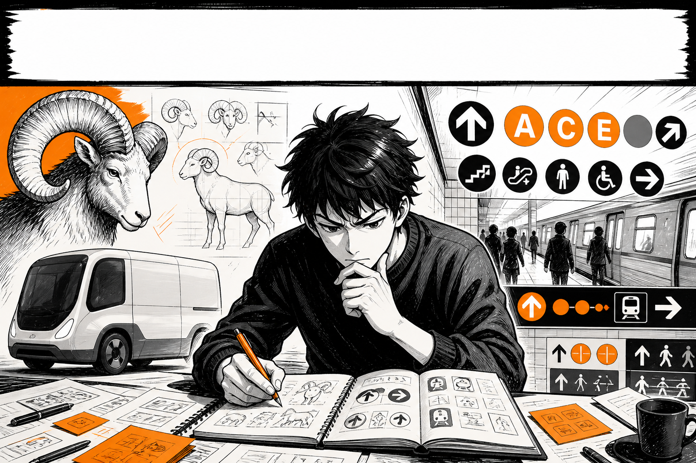

# Dr Non's Rams × NYCTA Design Core



The transit HUD in the banner — route-style discs, pictograms, platform scene — is **illustration only**. It is not a shipped interface, not a component spec, and not official MTA or NYCTA signage.

> Less, but better.  
> Information at the point of decision. Never before. Never after.  
> When the colour system disappears as "design" — it is finished.

**By** Non Arkaraprasertkul — architect, anthropologist, decision-systems builder.  
**Lineage** (inspiration, not affiliation): Dieter Rams · Bob Noorda & Massimo Vignelli / Unimark International · the 1970 NYCTA Graphics Standards Manual.  
**This is not** an official Rams, Braun, Vitsœ, Unimark, NYCTA, or MTA product. No endorsement is claimed or implied.

Throw this repo at any agent. The spine is [`AGENTS.md`](AGENTS.md). Install steps are in [`USAGE.md`](USAGE.md). Original work is MIT — see [`LICENSE`](LICENSE) and [`NOTICE.md`](NOTICE.md).

---

## What this is

A **reproduction-grade interface standard** for decision UIs: exact values, not vibes. Tokens, two manuals, a live gallery, and an agent spine so a human or a model can ship a surface without inventing the system.

It is a civic-studio toolkit: silence first, wayfinding only when the product has routes, provenance on every number.

| You get | You do not get |
|---|---|
| Layer 1 Rams foundation — warm-grey field, hairline grid, one typeface, one accent | Official MTA / NYCTA identity, maps, or signage artwork |
| Layer 2 NYCTA-inspired wayfinding — closed trunk palette, disc, station plate, arrow | Rams, Braun, or Vitsœ brand assets or manuals |
| Agent DNA, drop-in `tokens.css`, `components.html`, `quick-start.html` | A font license (Helvetica Neue is named, not shipped) |
| Original writing and original concept sheets under MIT | A license to copy or sell the 1970 Graphics Standards Manual |

The four habits under the rules: **balanced, compact, no non-sense, communicative.** Full text in [`AGENTS.md`](AGENTS.md) §4.

| If you are… | Read |
|---|---|
| An **AI agent** | [`AGENTS.md`](AGENTS.md) — the 5-line DNA |
| **Installing** in a project | [`USAGE.md`](USAGE.md) |
| After the **full operating standard** | [`RAMS-DESIGN-DNA.md`](RAMS-DESIGN-DNA.md) + [`RAMS-x-NYCTA-DNA.md`](RAMS-x-NYCTA-DNA.md) |
| A **human** wanting the public brief | This README, then [`tokens.css`](tokens.css) |

---

## Philosophy

Two masters. One law.

**Dieter Rams** gave silence — a warm-grey field where data leads and the tool disappears. Every element justified by function. Everything else removed. The mark of a resolved design: the user cannot imagine a rational alternative.

**Bob Noorda and Massimo Vignelli** (Unimark, 1970 NYCTA Graphics Standards Manual) gave, inside that silence, a voice for orientation — a small, closed, coded set of colours that say where you are and where to go, and say nothing else. Enclosed colour for identity. Bare colour for signal. The two never blur.

Neither contradicts the other. Both obey the same law: **nothing appears that does not serve a decision.** Rams removes the decorative. Unimark codifies the necessary. Colour is the smallest amount of signage required to navigate a complex system safely.

Both aim at **inevitability.** Orange is macro. The disc is the address. The arrow is forward. When design is present only as function, it is done.

This repo applies that law to screens. It does not speak for Rams, Vitsœ, Braun, Unimark, the Vignelli or Noorda estates, NYCTA, or the MTA.

### Studio additions (Non's layer)

These are the author's operating rules. They are not Rams's or Unimark's.

| Mantra | On a surface |
|---|---|
| Life is precious. The fun is in the flow. | Friction breaks flow. If a label needs a tooltip, the layout has failed. |
| Help the user find their Ikigai. Listen first. | State before action. Vital signs up. The one lever one decision away. |
| Positive contribution, not performative positivity. | No vanity metric. Worst case visible. Provenance is the moral stance. |
| Friend → mentor → confidant. Concise, precise, perfect. | Small letterspaced labels. Tabular values at weight 600. Hairline alignment. |
| Suspend the catastrophe verdict. Help others first. | Show uncertainty: lag, confidence, last refresh. A number without provenance is unsafe. |
| Work with the symbols anyway. | Disc, arrow, hairline are agreements. They still carry the train. |

**Name the problem before you build the path.** Suffering → origin → cessation → components. Most projects start at the last step.

**Wabi-sabi:** real data, real timestamps, real uncertainty. **Kodawari:** every hairline 1px; every 9px label tracked to 0.14em. Care is how the surface becomes trustworthy.

---

## Ethical use

Respect the lineage. Do not borrow the names as a stamp.

This toolkit is an **original interface interpretation**. Using it does not make a product official, affiliated, or endorsed. Do not write "MTA," "NYCTA," "Rams," "Braun," "Vitsœ," or "Unimark" on a shipped surface as if they signed it.

**Attribute the sources when you write about the system.** Credit Dieter Rams's Ten Principles (published by Vitsœ). Credit Bob Noorda, Massimo Vignelli, and Unimark International for the 1970 NYCTA Graphics Standards Manual. Credit MTA New York City Transit as the rights holder of official subway wayfinding. Credit this repo for the screen interpretation and tokens.

**Do**

- Use the original tokens, recipes, and agent spine under MIT
- Name the inspiration in documentation, with the "not official / no endorsement" line
- Keep identity colour enclosed and signal colour bare
- Treat the hero HUD, concept sheets, and any MTA-like discs as drawings of a grammar — not as official artwork to lift

**Do not**

- Imply endorsement by Rams, Braun, Vitsœ, Unimark, NYCTA, the MTA, or the Vignelli/Noorda estates
- Copy, redistribute, or sell the 1970 Graphics Standards Manual
- Use official MTA/NYCTA maps, bullets, signage drawings, or trademarks
- Reproduce Braun drawings, Vitsœ brand assets, or Rams publicity likeness as if licensed here
- Ship Helvetica Neue from this repo (it is not here; obtain your own license)
- Present the banner HUD as a live product UI or as MTA-issued signage

Full boundary: [`NOTICE.md`](NOTICE.md).

---

## How it works

Layers are additive. Layer 1 governs everything. Layer 2 is added only when the product has navigable boards. The studio layer (philosophy, provenance, worst-case visible) is always in force.

```
STUDIO — Non's additions
  Worst-case visible · provenance shown · uncertainty stated ·
  the interface listens before it speaks

LAYER 2 — NYCTA-inspired wayfinding (RAMS-x-NYCTA-DNA.md)
  Disc · station plate · arrow · closed trunk palette ·
  enclosed = identity · bare = data

LAYER 1 — Rams foundation (RAMS-DESIGN-DNA.md)
  Greyscale tokens · type scale · hairline grid · one accent ·
  the ten principles · the ban list
```

When in doubt, start with Layer 1.

### Colour decision tree

Run top to bottom. Stop at the first match.

```
Should this be coloured?
 │
 ├─ IDENTITY (which board / which route)?  → trunk colour, ENCLOSED (disc / plate / rule)
 ├─ DATA (live / critical / down)?         → --accent / --neg, BARE
 ├─ DIRECTIONAL (go here / forward)?       → greyscale solid triangle, never colour
 └─ None of these?                         → no colour. Grey + size.
```

If you add colour to liven it up, delete it.

### Enclosure law

| Form | Meaning |
|---|---|
| **Colour enclosed** (disc, plate) | Identity — which board am I on? Constant. |
| **Colour bare** (text, bar, number) | Signal — is this value up, down, live? Dynamic. |

Never invert it. Enclosure is what keeps a dense screen legible.

### Cockpit

Keep the fewest instruments needed to operate safely in view. Everything else is one decision away. Vital signs at the top. Provenance on every metric (source + date/time).

### Files

| File | What it is |
|---|---|
| [`AGENTS.md`](AGENTS.md) | 5-line DNA for any agent |
| [`USAGE.md`](USAGE.md) | Install steps per agent type |
| [`RAMS-DESIGN-DNA.md`](RAMS-DESIGN-DNA.md) | Rams operating standard |
| [`RAMS-x-NYCTA-DNA.md`](RAMS-x-NYCTA-DNA.md) | Wayfinding synthesis |
| [`tokens.css`](tokens.css) | Drop-in CSS variables |
| [`components.html`](components.html) | Live gallery |
| [`quick-start.html`](quick-start.html) | Cockpit + board template |
| [`docs/hero-banner.png`](docs/hero-banner.png) | Public hero illustration (HUD = drawing only) |
| [`assets/photos/`](assets/photos/) | Original educational concept sheets |
| [`LICENSE`](LICENSE) | MIT for original work |
| [`NOTICE.md`](NOTICE.md) | What MIT does not relicense |

---

## How to use

### Agents

1. Read [`AGENTS.md`](AGENTS.md).
2. Identify the layer: Rams-only (single view) or Rams + NYCTA-inspired wayfinding (multi-board).
3. Run the colour decision tree before adding any colour.
4. Apply [`tokens.css`](tokens.css).
5. If the product has live data, apply the cockpit pattern.
6. Give every metric a source and a time.
7. Remove one thing before you call it done.

Per-agent install: [`USAGE.md`](USAGE.md). One-shot: clone, point the agent at `AGENTS.md`. Persistent: copy `AGENTS.md` to the project root.

### Tokens — Layer 1 (always)

Drop on any wrapper. Style from `var(--…)`. Prefer the file over this block when you can.

```html
<div style="--paper:#faf9f7; --panel:#fff; --ink:#191712; --ink-2:#6f6c63;
            --ink-3:#a9a59a; --line:#e7e5dd; --line-2:#d2cfc5;
            --accent:#1f6e43; --neg:#a23a26;
            background:var(--paper); color:var(--ink);
            font-family:'Helvetica Neue',Helvetica,Arial,sans-serif;
            font-variant-numeric:tabular-nums; font-size:13px; line-height:1.42;
            -webkit-font-smoothing:antialiased;">
  …
</div>
```

Canonical grotesque is Helvetica Neue (obtain your own license). Inter is the free screen equivalent loaded in `tokens.css`.

### Tokens — Layer 2 (navigable boards only)

Publicly documented MTA trunk hexes, used here as **factual colour tokens** for a closed software palette. This is not a license to use official MTA identity. Show about five families at once. Dark glyph on yellow only.

```css
:root {
  --rt-blue:   #0039A6;  /* A·C·E */
  --rt-orange: #FF6319;  /* B·D·F·M */
  --rt-green:  #00853F;  /* 4·5·6 */
  --rt-red:    #EE352E;  /* 1·2·3 */
  --rt-purple: #B933AD;  /* 7 */
  --rt-yellow: #FCCC0A;  /* N·Q·R·W — dark glyph only */
  --rt-grey:   #6D6E71;  /* L · shuttle */
  --rt-brown:  #996633;  /* J·Z */
  --rt-ink:    #191712;  /* Hub / home */
}
```

### Hard bans

- Gradients, drop shadows, glows, blurs, glassmorphism
- Rounded corners (0–2px maximum, structurally unavoidable only)
- More than one free accent
- Pure `#000` or pure `#fff`
- Font weights 700+ on data; more than one type family on a surface
- Centering dense content
- Entrance animations, scroll reveals, parallax; bounce/elastic easing
- Bare coloured text that is not data-signal
- More than ~5 trunk families visible at once
- A unique colour per board (use trunk families + glyphs)
- Unicode arrows or chevrons — solid greyscale triangle only
- White glyphs on `--rt-yellow`
- A ninth trunk colour, or a custom shade
- Filler, placeholder, decoration of any kind

Motion that remains: real easing curves and press feedback. See `RAMS-DESIGN-DNA.md` §6.

### Ten principles → build rules

| Rams principle | On a screen |
|---|---|
| 1. Innovative | Clarity and density, not novelty for its own sake. |
| 2. Useful | Every element serves a user decision. Decorative = delete. |
| 3. Aesthetic | Beauty is order: grid, alignment, restraint. |
| 4. Understandable | The layout explains itself. No mystery-meat navigation. |
| 5. Unobtrusive | Neutral palette, quiet type. The tool recedes. |
| 6. Honest | Provenance, dates, caveats, uncertainty. Never fake precision. |
| 7. Long-lasting | No trend finishes. |
| 8. Thorough | Tabular figures, aligned columns, 0.14em at 9px. |
| 9. Environmentally friendly | Lightweight. Fast paint. |
| 10. As little design as possible | The master rule. When stuck, remove. |

The Ten Principles remain the property of their rights holders. This table is an interface reading, not a relicense.

---

## License and NOTICE

Original software and original writing in this repository are under the [MIT License](LICENSE), copyright Non Arkaraprasertkul.

MIT covers: `tokens.css`, `components.html`, `quick-start.html`; original writing in the manuals and this README; original concept sheets in `assets/photos/`; the original hero illustration `docs/hero-banner.png`.

MIT does **not** cover: Rams / Braun / Vitsœ materials and trademarks; the 1970 NYCTA Graphics Standards Manual; official MTA / NYCTA wayfinding identity; commercial typefaces; third-party works credited in [`NOTICE.md`](NOTICE.md).

This is **not** an official Rams, Braun, Vitsœ, Unimark, NYCTA, or MTA product.

Read [NOTICE.md](NOTICE.md) before you ship.

---

> "Less, but better" — Dieter Rams  
> "Design is one of the few professions in which you are not allowed to confuse the public." — Massimo Vignelli  
> "The fun is in the flow." — Non Arkaraprasertkul

*Non Arkaraprasertkul · axiom.nonarkara.org*
